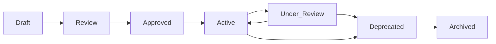

# Rules

Governance, constraints, policies, and guardrails.

## What Belongs Here

- Business rules and constraints
- Technical policies and standards
- Governance and compliance requirements
- Quality gates and checkpoints
- Security policies and controls
- Decision criteria and thresholds

## Rule Template

```markdown
---
title: [Rule] X Policy
type: system
subtype: rule
tags: [rule, governance, area]
created: 2024-01-15T10:00:00Z
modified: 2024-01-15T10:00:00Z
version: 1
ship_factor: 8
active: true
enforcement: mandatory|recommended|optional
severity: critical|high|medium|low
---

# [Rule] X Policy

## Rule Statement
Clear, unambiguous statement of the rule.

## Rationale
Why this rule exists:
- Business reason
- Technical reason
- Compliance requirement
- Risk mitigation

## Scope

### Applies To
- Systems: [list]
- Teams: [list]
- Processes: [list]
- Timeframe: [always|business-hours|specific]

### Exceptions
- Exception 1: [condition and reason]
- Exception 2: [condition and reason]

## Implementation

### Automated Enforcement
```yaml
type: github-action|pre-commit|policy-engine
config:
  trigger: on-push|on-merge|scheduled
  action: block|warn|log
```

### Manual Enforcement
- Checkpoint: [where/when to check]
- Responsible: [who checks]
- Frequency: [how often]

## Validation

### How to Check Compliance
```bash
# Command or query to verify
check-compliance --rule=X
```

### Success Criteria
- Criterion 1: [measurable]
- Criterion 2: [measurable]

### Violation Response

| Severity | First Offense | Repeated |
|----------|--------------|----------|
| Critical | Block + Alert | Escalate |
| High | Warn + Log | Block |
| Medium | Log | Warn |
| Low | Track | Log |

## Examples

### ✅ Compliant
```code
// Example that follows the rule
```

### ❌ Non-Compliant
```code
// Example that violates the rule
```

### 🔧 How to Fix
```code
// Corrected version
```

## Metrics

- **Compliance Rate**: [how measured]
- **Violation Frequency**: [tracking]
- **Impact**: [business/technical metrics]
- **Enforcement Cost**: [time/resources]

## Related

- Parent Policy: [if part of larger policy]
- Related Rules: [similar/connected rules]
- Workflows: [implementing workflows]
- References: [external standards]

## Review Schedule

- Effectiveness Review: [quarterly]
- Compliance Audit: [monthly]
- Rule Relevance: [annually]

## Change Process

1. Propose change with rationale
2. Impact analysis
3. Stakeholder approval
4. Grace period announcement
5. Implementation
6. Monitoring
```

## Rule Categories

### Technical Rules
- `no-direct-database-access.md`
- `api-versioning-required.md`
- `code-coverage-minimum.md`
- `performance-budgets.md`

### Security Rules
- `authentication-required.md`
- `encryption-at-rest.md`
- `secret-management.md`
- `access-control-matrix.md`

### Operational Rules
- `deployment-windows.md`
- `change-freeze-periods.md`
- `backup-requirements.md`
- `monitoring-thresholds.md`

### Business Rules
- `data-retention-policy.md`
- `sla-commitments.md`
- `approval-chains.md`
- `budget-limits.md`

### Quality Rules
- `code-review-required.md`
- `testing-standards.md`
- `documentation-requirements.md`
- `naming-conventions.md`

## Enforcement Levels

### Mandatory
- Must be followed
- Violations blocked
- Exceptions require executive approval

### Recommended
- Should be followed
- Violations warned
- Exceptions require justification

### Optional
- Good practice
- Violations tracked
- No approval needed

## Rule Lifecycle



## Writing Good Rules

### DO:
✅ Be specific and measurable
✅ Include clear examples
✅ Provide fix instructions
✅ Define exceptions clearly
✅ Automate where possible

### DON'T:
❌ Be vague or ambiguous
❌ Create unenforceable rules
❌ Forget about edge cases
❌ Skip the rationale
❌ Make rules too complex

## Monitoring Compliance

### Automated Monitoring
```yaml
monitor:
  - tool: github-actions
    frequency: on-commit
    action: block-if-violated
  
  - tool: datadog
    frequency: continuous
    action: alert-on-threshold
```

### Manual Audits
- Weekly: High-severity rules
- Monthly: All active rules
- Quarterly: Rule effectiveness
- Annually: Rule relevance

## Exception Handling

1. **Request**: Document reason and duration
2. **Review**: Assess risk and impact
3. **Approval**: Based on severity
4. **Track**: Log exception
5. **Monitor**: Watch for patterns
6. **Expire**: Auto-revert when done